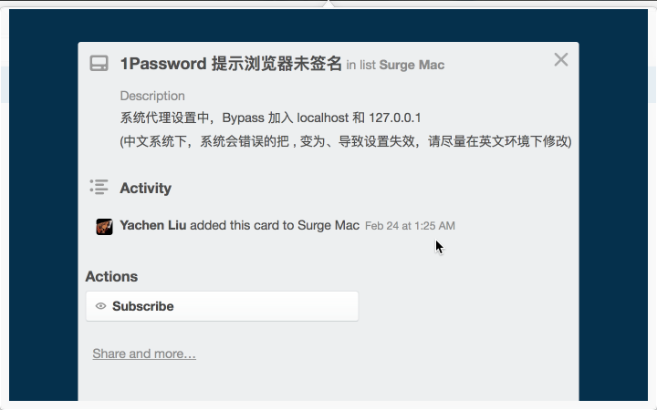

#Set proxy url for surge with alfred

##Get your networkservices' names

```
networksetup -listallnetworkservices
```

##Set proxy url

```
echo $PASSWD | sudo -S networksetup -setwebproxy "Wi-Fi" ${domain} ${portnumber} off

echo $PASSWD | sudo -S networksetup -setsecurewebproxy "Wi-Fi" ${domain} ${portnumber} off

echo $PASSWD | sudo -S networksetup -setproxybypassdomains "Wi-Fi" ${domain} ${domain2}

echo $PASSWD | sudo -S networksetup -setsocksfirewallproxy "Wi-Fi" ${domain} ${socksPortNumber}
````

##Official manual page for networksetup command

[man networksetup](https://developer.apple.com/library/mac/documentation/Darwin/Reference/ManPages/man8/networksetup.8.html)

##Why use this script

[偶尔在 ShadowsocksX 和 Surge for Mac 之间切换，不想手动修改 http 和 https 代理地址](https://twitter.com/yxjxx/status/702852960842190853)

[surge 会影响到 1Password 的自动填充。要 bypass 掉 localhost 和127.0.0.1](https://twitter.com/yxjxx/status/713327566296207360)

[Surge Mac 更新到 1.1.0，加入 SOCKS5 模式支持，默认端口号 6153，可以在系统设置中同时设置 HTTP/HTTPS/SOCKS 3个代理，这样能解决 https://t.co/5SFHZlIXIc 等应用不走 HTTP 代理的问题](https://twitter.com/Blankwonder/status/719760954167156736)


